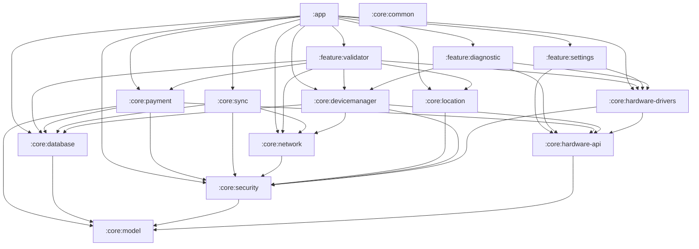
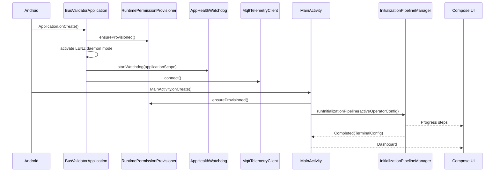
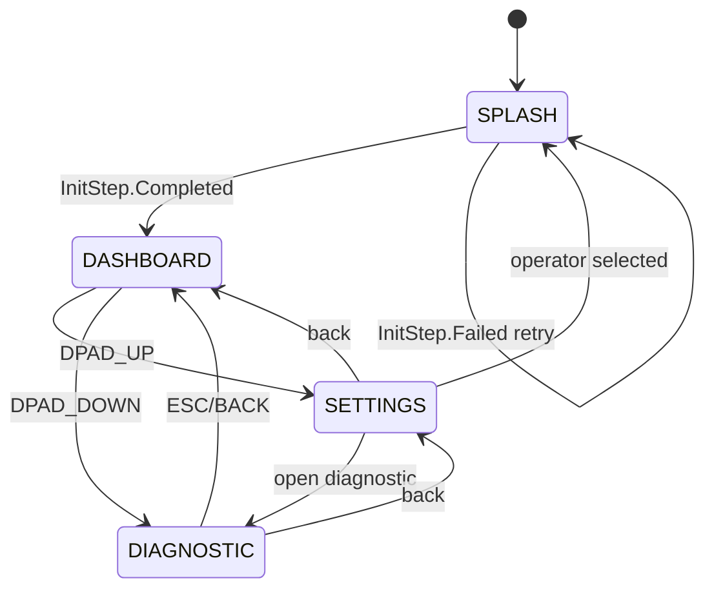
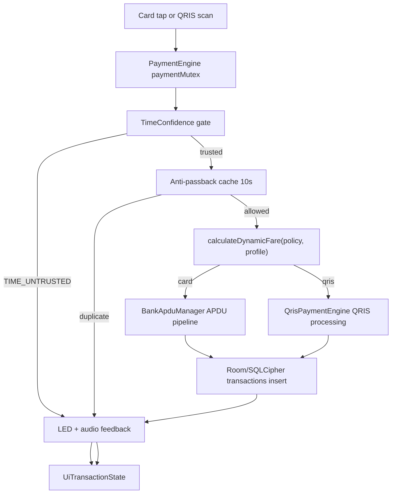
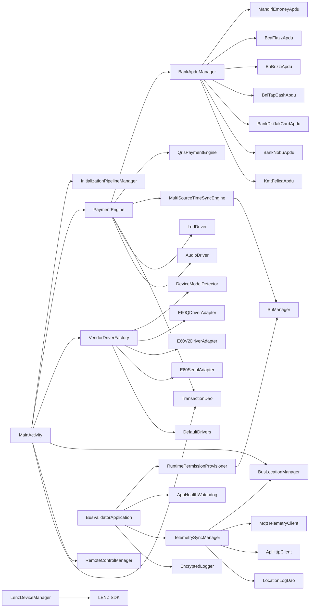

# DeviceApp - Enterprise Bus Validator Android

DeviceApp adalah aplikasi Android Kotlin untuk perangkat validator bus dedicated. Implementasi saat ini sudah memuat shell aplikasi Compose fullscreen, dependency injection Hilt, database Room terenkripsi SQLCipher, payment engine kartu/QRIS, hardware abstraction layer, adapter awal LENZ E60, provisioning permission berbasis root/Device Owner, watchdog, MQTT telemetry/remote-command client, settings operator, dan diagnostic screen.

README ini adalah pintu masuk developer. Gunakan dokumen di `docs/` untuk detail per domain, dan baca bagian "Status Implementasi Saat Ini" sebelum melanjutkan fitur agar tidak menganggap extension point sebagai fitur produksi yang sudah selesai.

## Status Implementasi Saat Ini

| Area | Status real di source | File utama |
| --- | --- | --- |
| App shell | Ada. `BusValidatorApplication` start logger, permission provisioner, daemon LENZ, watchdog, MQTT. `MainActivity` menjalankan splash, dashboard, settings, diagnostic. | `app/src/main/java/com/enterprise/busvalidator/` |
| UI validator | Ada. Compose fullscreen, operator-specific dashboard untuk Biskita, Citra, Surabaya, state success/fail/processing, simulator action bar. | `feature/validator/` |
| Settings | Ada. Pilih operator preset dan manual vendor override. Perubahan operator memicu ulang initialization pipeline. | `feature/settings/` |
| Diagnostic | Ada. ViewModel menguji NFC, SAM, SDK/kernel info, scanner, audio, LED, serial, plus beberapa status statis. | `feature/diagnostic/` |
| Domain model | Ada. Operator preset, fare policy, terminal config, bank issuer, card info, transaction record, telemetry status. | `core/model/DomainModels.kt` |
| Database | Ada. Room + SQLCipher untuk tabel `transactions`, `location_logs`, `transaction_counter_allocations`, dan `device_counter_state`; location log disimpan 7 hari dan schema memakai migration eksplisit 1->2->3. | `core/database/` |
| Payment card | Ada. Mutex transaction, time gate, anti-passback 10 detik, bank APDU dispatcher, commit DB, LED/audio feedback. APDU handler masih berbasis adapter/protokol awal dan test lambda, bukan sertifikasi bank produksi. | `core/payment/` |
| QRIS | Ada. Generate/process payload QRIS, CRC16-CCITT validation, RRN-like transCode, commit DB lewat `PaymentEngine`. | `core/payment/qris/` |
| Sync | Ada. Transaction sync memakai API ACK contract: idempotent batch upload, accepted transaction IDs, backend last-counter validation, dan conflict gate. GPS telemetry otomatis: persist location log, publish MQTT, API fallback, drain ulang pending log, dan prune 7 hari. | `core/sync/` |
| Network | Ada. Ktor client untuk terminal config dan API fallback telemetry, Paho MQTT dengan reconnect loop, QoS 1 location publish, payment response flow, remote command flow. | `core/network/` |
| Time validation | Ada. Default untrusted sampai ada trusted source; persisted monotonic anchor, GPS NMEA, Android network clock API 33+, SNTP fallback, root correction, QRIS/card gate, dan continuous validation. Reboot offline tanpa source tepercaya tetap diblokir. | `core/security/MultiSourceTimeSyncEngine.kt`, `core/location/` |
| HAL | Ada kontrak dan factory. E60Q/E60V2 adapter tersedia, generic default driver tersedia, Q6/Z90/A90/Telpo/MSI masih fallback/gap. | `core/hardware-api/`, `core/hardware-drivers/` |
| Device management | Ada. Watchdog memory pressure, initialization pipeline, remote commands, LENZ system manager wrapper. | `core/devicemanager/` |
| Security/storage | Ada encrypted logger, SQLCipher DB, encrypted backup helper, decryptor utility. Key/passphrase saat ini hard-coded dan harus diganti sebelum produksi. | `core/security/`, `core/database/` |

## Quick Start

### Prerequisites

- Android Studio recent stable.
- JDK 17.
- Android Gradle Plugin 8.5.2.
- Kotlin 2.0.20.
- Android SDK compile/target 35, minSdk 21.
- Vendor SDK files for real LENZ build paths:
  - `libs/vendor-sdk/e60/E60Q/E60QSDK-release.aar`
  - `libs/vendor-sdk/e60/E60Q/jtbqrcodesdk-release.aar`
  - `libs/vendor-sdk/e60/E60V2/E60V2SDK-release.aar`

The vendor SDK dependencies are `compileOnly`; they must be present for compilation, but packaging/runtime behavior still depends on device image and vendor services.

### Build

```bash
./gradlew :app:assembleDebug
```

### Test

```bash
./gradlew :core:payment:testDebugUnitTest
./gradlew :core:hardware-drivers:testDebugUnitTest
```

### Useful commands

| Command | Purpose |
| --- | --- |
| `./gradlew projects` | Show included modules. |
| `./gradlew :app:assembleDebug` | Build debug APK. |
| `./gradlew :app:assembleRelease` | Build release APK with minify/shrink enabled. |
| `./gradlew :core:payment:testDebugUnitTest` | Validate APDU/QRIS/payment unit tests. |
| `./gradlew :core:hardware-drivers:testDebugUnitTest` | Validate driver unit tests. |
| `./gradlew clean` | Remove Gradle build outputs. |

Versioning is dynamic in `app/build.gradle.kts`: `versionCode` uses `git rev-list --count HEAD`, and `versionName` uses `2.5.0-<commitCount>.<shortHash>`.

## Repository Structure

```text
DeviceApp/
├── app/
│   └── src/main/
│       ├── AndroidManifest.xml
│       ├── java/com/enterprise/busvalidator/
│       │   ├── BusValidatorApplication.kt
│       │   ├── MainActivity.kt
│       │   ├── app/BootReceiver.kt
│       │   ├── app/BusValidatorDeviceAdminReceiver.kt
│       │   └── di/AppModule.kt
│       └── res/xml/
├── core/
│   ├── common/
│   ├── model/
│   ├── database/
│   ├── security/
│   ├── network/
│   ├── hardware-api/
│   ├── hardware-drivers/
│   ├── payment/
│   ├── sync/
│   ├── location/
│   └── devicemanager/
├── feature/
│   ├── validator/
│   ├── settings/
│   └── diagnostic/
├── docs/
├── plans/
├── libs/vendor-sdk/
├── settings.gradle.kts
└── gradle/libs.versions.toml
```

## Module Dependency Graph



## Runtime Flow



## Screen Flow



Physical key behavior lives in `MainActivity.onKeyDown()`:

- `DPAD_UP`: open settings.
- `DPAD_DOWN`: open diagnostic.
- `ESC/BACK`: return to dashboard when not already on dashboard.

## Payment Flow



Card payment is implemented in `PaymentEngine.processCardApduFlow()`:

1. Lock with `Mutex` so only one payment flow runs at a time.
2. Reject if `MultiSourceTimeSyncEngine.timeConfidence` is `TIME_UNTRUSTED`.
3. Reject repeated card UID within 10 seconds.
4. Calculate fare from `FareRulePolicy` and `PassengerProfile`.
5. Run `BankApduManager.processFullCardApduPipeline()`.
6. Reject insufficient balance or failed deduct.
7. Commit `TransactionEntity` with `isSynced = false`.
8. Update time checkpoint and trigger LED/audio success.

QRIS payment is implemented in `PaymentEngine.processQrisTapFlow()` and `QrisPaymentEngine`.

## Code Graph



## Core Contracts

### Hardware API

`core/hardware-api/HardwareInterfaces.kt` defines framework-independent contracts:

- `NfcDriver.startCardListening(onCardDetected)`
- `SamDriver.powerOnSamSlot()`, `transmitSamApdu()`, `powerOffSamSlot()`
- `SerialDriver.openSerialPort()`, `writeSerialData()`, `readSerialDataFlow()`, `closeSerialPort()`
- `ScannerDriver.startQrScan()`, `stopQrScan()`
- `LedDriver.setLedSuccess()`, `setLedFailed()`, `setLedProcessing()`, `turnOffLeds()`
- `AudioDriver.playSound(SoundType)`
- `KeypadDriver.keyEventsFlow()`

Feature modules should depend on these interfaces or on app-provided dependencies, not on vendor SDK classes.

### Bank APDU

`BankApduHandler` is the bank/card protocol boundary:

- `selectApplication()`
- `readCardInfo()`
- `processAutoCompletion()`
- `processMandiriGracePeriod()`
- `deduct()`

`BankApduManager` owns probing and orchestration. `PaymentEngine` owns business gates and transaction persistence.

### Database

Current schema is version 3:

```text
transactions(
  transactionId TEXT PRIMARY KEY,
  transCode TEXT,
  transactionCounter INTEGER,
  cardUid TEXT,
  bankIssuer TEXT,
  amountDeducted INTEGER,
  initialBalance INTEGER,
  finalBalance INTEGER,
  timestampUtc INTEGER,
  tapMode TEXT,
  passengerProfile TEXT,
  status TEXT,
  isSynced INTEGER,
  recordSignature TEXT
)

location_logs(
  id INTEGER PRIMARY KEY AUTOINCREMENT,
  deviceId TEXT,
  recordedAtUtc INTEGER,
  provider TEXT,
  latitude REAL,
  longitude REAL,
  altitudeMeters REAL NULL,
  accuracyMeters REAL NULL,
  verticalAccuracyMeters REAL NULL,
  bearingDegrees REAL NULL,
  bearingAccuracyDegrees REAL NULL,
  speedMetersPerSecond REAL NULL,
  speedAccuracyMetersPerSecond REAL NULL,
  elapsedRealtimeNanos INTEGER,
  satelliteCount INTEGER NULL,
  isMock INTEGER,
  isDelivered INTEGER,
  deliveredAtUtc INTEGER NULL,
  deliveryTransport TEXT NULL,
  deliveryAttemptCount INTEGER,
  lastDeliveryError TEXT NULL
)

transaction_counter_allocations(
  transactionCounter INTEGER PRIMARY KEY,
  transactionId TEXT UNIQUE,
  allocatedAtUtc INTEGER
)

device_counter_state(
  counterId TEXT PRIMARY KEY,
  lastSuccessCounter INTEGER,
  lastBackendAckCounter INTEGER,
  syncConflictReason TEXT NULL,
  updatedAtUtc INTEGER
)
```

`transactionCounter` is the device success-ledger counter, not the bank/card APDU counter. It is allocated only for successful local card/QRIS commits inside a Room transaction, then synced to the backend with exact accepted transaction IDs and exact backend last-counter acknowledgement. If the backend acknowledgement does not match the local success ledger, `device_counter_state.syncConflictReason` is set and new successful commits are blocked until reconciliation.

`location_logs` are retained for 7 days. Schema 1->2 adds location logs, and schema 2->3 adds counter allocation/state tables with deterministic legacy success-counter backfill. Keep future schema changes migration-backed.

## Operator Model

Operator presets live in `OperatorPresets`:

- Biskita Bekasi: E60Q/E60V2, base fare 4000.
- Biskita Depok: E60V2, base fare 3500.
- Biskita Bogor: E60Q/E60V2, base fare 4000.
- Citra Raya: E60Q/E60V2, base fare 5000.
- Citra Maja: E60Q/E60V2, base fare 5000.
- Wara Wiri Surabaya: E60Q, base fare 5000, transfer window 30 minutes.
- Bus Surabaya: Q6, base fare 5000, transfer window 30 minutes.

When an operator is selected in Settings, `MainActivity` updates `activeOperatorConfig`, returns to splash, and re-runs the initialization pipeline.

## Device Deployment Context

This app assumes a dedicated validator device, not a normal consumer phone:

- It declares fullscreen launcher and HOME categories.
- It has boot receivers for `BOOT_COMPLETED`, `LOCKED_BOOT_COMPLETED`, and `MY_PACKAGE_REPLACED`.
- It declares protected permissions such as `REBOOT`, `SET_TIME`, `INSTALL_PACKAGES`, `DELETE_PACKAGES`, and `WRITE_SECURE_SETTINGS`.
- Runtime permission provisioning attempts root `pm grant` and `appops` commands.
- Device Owner fallback is used for runtime permission grant and HOME setup when active.
- LENZ daemon mode is started from `BusValidatorApplication`.

On emulator/non-root devices, provisioning failures are expected. Treat emulator as UI/business-logic validation only.

## Documentation Index

| Document | Use it for |
| --- | --- |
| `docs/architecture.md` | Current architecture, module boundaries, dependency rules, runtime flow. |
| `docs/codegraph.md` | Class-level code graph and ownership map. |
| `docs/payment_engine.md` | Card/QRIS payment flow, APDU extension points, transaction persistence. |
| `docs/hardware_abstraction.md` | HAL contracts, vendor factory behavior, E60 integration status. |
| `docs/security_and_storage.md` | SQLCipher, encrypted logs/backups, keys, sync status, production hardening gaps. |
| `docs/time_validation.md` | Current monotonic/GPS time implementation and missing time-source work. |
| `docs/device_management.md` | Boot, provisioning, watchdog, remote commands, LENZ wrapper. |
| `docs/ui_and_flows.md` | Compose screens, navigation, settings, diagnostic behavior. |
| `docs/extension_playbook.md` | Step-by-step guide to add new operators, vendors, banks, screens, DB fields, and sync. |

## Adding a New Feature

Before coding, identify the feature type:

| Feature type | Primary module | Rules |
| --- | --- | --- |
| New operator/service/fare | `core:model`, `feature/settings`, `feature/validator` | Add preset first, then UI selection and dashboard presentation. Keep payment calculation in core. |
| New bank/e-money card | `core:payment` | Add a `BankApduHandler`; register it in `BankApduManager`; add unit tests. |
| New vendor hardware | `core:hardware-api` if contract changes, `core:hardware-drivers` for implementation, `app/di` for binding if needed | Do not expose vendor SDK classes to feature or domain modules. |
| New persisted field | `core:database`, `core:model`, `core:payment`/sync user | Add explicit Room migration before production. Do not rely on destructive migration. |
| New remote command | `core:devicemanager`, maybe `core:network` | Validate action, constrain parameters, avoid arbitrary command execution. |
| New screen | `feature:<name>` or existing feature module | UI state only in feature; business logic stays in core. |
| New network endpoint | `core:network`, caller module | Keep endpoint contract typed; no UI-owned network calls. |
| New sync behavior | `core:sync`, `core:network`, `core:database` | Preserve idempotency with stable transaction IDs, monotonic success counters, full accepted-ID ACK, and backend last-counter validation. |

## Production Hardening Gaps

These are intentionally documented so the next developer does not over-claim readiness:

- SQLCipher passphrase and AES log/backup key are hard-coded. Move to Android Keystore, hardware keystore, injected secure provisioning, or vendor secure element flow.
- Backend must implement `/transactions/sync` with the same ACK contract used by `SyncManager`: idempotent `batchId`/`Idempotency-Key`, exact `acceptedTransactionIds`, and exact `backendLastCounter`. Device-side conflict handling is implemented.
- `InitializationPipelineManager` currently creates terminal config locally from operator presets; integrate real parameter fetch and validation.
- Time validation still needs target-device verification for vendor RTC/NITZ behavior; app-level SNTP/GPS/monotonic anchor is implemented.
- Generic hardware drivers return successful no-op behavior; do not use those for field acceptance.
- Q6/Z90/A90/Telpo/MSI enum values exist, but concrete drivers are not implemented.
- Payment APDU handlers need real device/card/SAM validation and bank certification before production settlement.
- MQTT broker URL, API fallback endpoint path, and device ID are hard-coded/config-defaulted.
- Release signing config is not documented in Gradle.

## Development Rules

- Keep business logic out of Compose screens.
- Keep vendor SDK usage inside `core/hardware-drivers` or `core/devicemanager`.
- Keep domain models Android-framework independent where possible.
- Use Hilt modules for dependency wiring.
- Add deterministic unit tests for payment, APDU, sync, and migration behavior.
- Prefer explicit migrations and typed contracts over fallback/destructive behavior.
- Document every new cross-module behavior in README and the matching `docs/` file.
