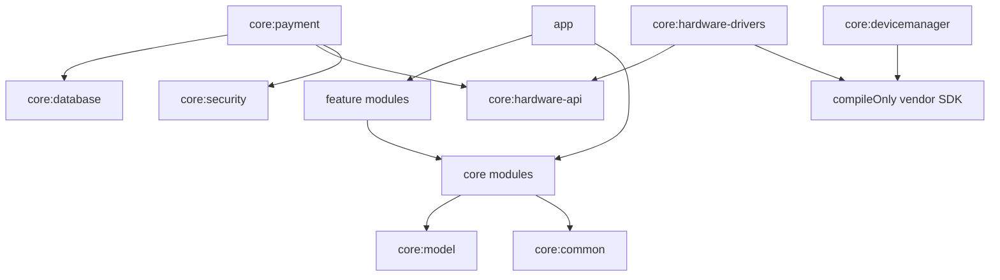
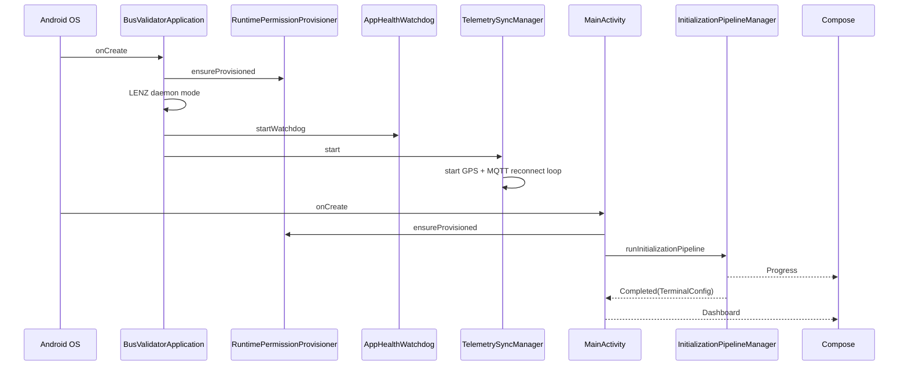

# Architecture

Dokumen ini menjelaskan arsitektur yang benar-benar ada di source saat ini. Untuk status ringkas, mulai dari `README.md`.

## Technical Restatement

DeviceApp adalah Android multi-module app untuk validator bus dedicated. Batas utama sistem:

- `app` sebagai composition root, lifecycle host, DI host, manifest, boot/device-admin receiver.
- `core:*` sebagai domain/infrastructure reusable modules.
- `feature:*` sebagai Compose UI modules.
- Vendor SDK harus tetap berada di layer hardware/device-management, tidak bocor ke UI/payment/domain.

## Constraints

- Dedicated unattended hardware, sehingga boot recovery, HOME activity, root provisioning, dan Device Owner fallback adalah bagian dari lifecycle.
- Payment harus serialized agar tidak ada dua flow transaksi berjalan bersamaan.
- Database lokal adalah source of truth offline untuk transaction ledger.
- UI harus fullscreen dan bisa dioperasikan dengan physical key.
- Emulator/non-root hanya valid untuk build, UI, dan sebagian unit test; bukan acceptance device.

## Module Ownership

| Module | Ownership | Notes |
| --- | --- | --- |
| `:app` | Application lifecycle, Hilt composition root, manifest permissions, receiver, screen routing. | Injects all core services into `MainActivity` and `BusValidatorApplication`. |
| `:core:common` | Shared utility. | Dispatchers, version provider, date/crypto helpers, result wrapper. |
| `:core:model` | Domain model and operator presets. | No Android framework dependency beyond Gradle Android library shell. |
| `:core:database` | Room/SQLCipher persistence. | Current schema version 2 with transaction and 7-day location-log storage. |
| `:core:security` | Logger, root shell, time confidence, permission provisioning, vault/decryptor. | Contains hard-coded secrets that must be replaced before production. |
| `:core:network` | Ktor HTTP and Paho MQTT. | MQTT has reconnect loop and QoS 1 location publish; Ktor is used for API fallback telemetry. |
| `:core:hardware-api` | HAL contracts. | Stable interfaces consumed by app/core/features. |
| `:core:hardware-drivers` | Vendor adapters and driver factory. | E60Q/E60V2 have adapters; other vendors fallback/default. |
| `:core:payment` | Business payment pipeline. | Owns time gate, anti-passback, APDU/QRIS processing, transaction commit. |
| `:core:sync` | Offline sync manager and telemetry sync orchestration. | Transaction upload remains simulated; location telemetry persists, retries, falls back to API, and prunes after 7 days. |
| `:core:location` | Android GPS/network location updates. | Emits full location snapshots, GNSS satellite count, and forwards GPS NMEA time sentences to the time engine. |
| `:core:devicemanager` | Watchdog, initialization, remote command, LENZ wrapper. | Remote commands are limited to reboot/restart/clear-cache today. |
| `:feature:validator` | Main dashboard and transaction state UI. | Compose UI only. |
| `:feature:settings` | Operator/vendor settings UI. | Calls callbacks owned by `MainActivity`. |
| `:feature:diagnostic` | Diagnostic UI/ViewModel. | Uses injected HAL and LENZ manager. |

## Dependency Direction

Rules:

- Feature modules can render state and dispatch callbacks, but core modules own logic.
- `core:payment` can depend on `core:database`, `core:security`, and `core:hardware-api`; UI must not implement payment rules.
- Vendor SDK classes belong in `core:hardware-drivers` and `core:devicemanager`.
- `:app` wires dependencies; it should not become a business-logic module.

## Runtime Lifecycle

## Screen State Ownership

`MainActivity` owns current screen as `mutableStateOf(Screen)`:

- `SPLASH`: renders `InteractiveInitializationSplashScreen`.
- `DASHBOARD`: renders `ValidatorDashboardScreen`.
- `SETTINGS`: renders `SettingsScreen`.
- `DIAGNOSTIC`: renders `HardwareDiagnosticScreen`.

`MainActivity` also owns the current `UiTransactionState` for simulator tap flows. A future production card-listening integration should move this orchestration into a ViewModel/use-case boundary so the activity does not grow into a god object.

## Architectural Alternatives Considered

### Single app module

Rejected. It would make vendor SDK, payment, UI, sync, and device-management concerns too coupled.

### Feature modules calling vendor SDK directly

Rejected. This would break multi-vendor support and make UI tests dependent on hardware.

### Full repository/use-case layering for every small class immediately

Deferred. Current app is still foundation-stage. The stronger next step is extracting payment and initialization orchestration out of `MainActivity` into testable ViewModels/use cases once real hardware listeners are wired.

## Current Risk Boundaries

- `MainActivity` is an orchestration hotspot.
- Secrets and URLs are hard-coded.
- Some docs/plans may describe intended future behavior; README and current `docs/` files are the source of truth for implemented behavior.
