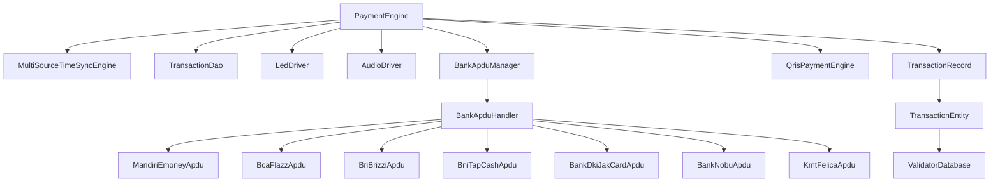
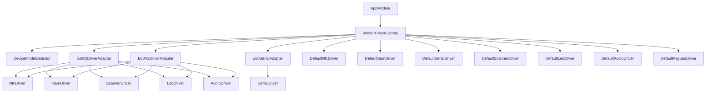
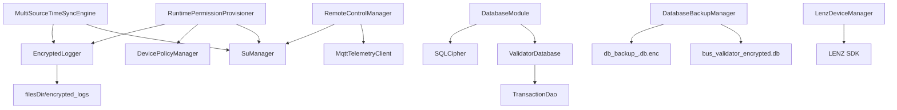

# Codegraph

This document maps the most important classes and ownership boundaries in the current implementation.

## Application Graph

```mermaid
flowchart TD
    BusValidatorApplication --> RuntimePermissionProvisioner
    BusValidatorApplication --> AppHealthWatchdog
    BusValidatorApplication --> MqttTelemetryClient
    BusValidatorApplication --> EncryptedLogger
    BusValidatorApplication --> LenzSystemManager["LenzSystemManager.Default().startDaemonApp"]

    MainActivity --> InitializationPipelineManager
    MainActivity --> PaymentEngine
    MainActivity --> VendorDriverFactory
    MainActivity --> BusLocationManager
    MainActivity --> RemoteControlManager
    MainActivity --> TransactionDao
    MainActivity --> RuntimePermissionProvisioner

    MainActivity --> InteractiveInitializationSplashScreen
    MainActivity --> ValidatorDashboardScreen
    MainActivity --> SettingsScreen
    MainActivity --> HardwareDiagnosticScreen
```

## Payment Graph

## Hardware Graph

## Security and Device Graph

## UI Graph

```mermaid
flowchart TD
    ValidatorDashboardScreen --> TopTelemetryHeader
    ValidatorDashboardScreen --> BiskitaIdleContent
    ValidatorDashboardScreen --> CitraIdleContent
    ValidatorDashboardScreen --> SurabayaIdleContent
    ValidatorDashboardScreen --> ProcessingStateContent
    ValidatorDashboardScreen --> SuccessStateContent
    ValidatorDashboardScreen --> CardAlreadyTappedContent
    ValidatorDashboardScreen --> InsufficientBalanceContent
    ValidatorDashboardScreen --> UntrustedTimeContent
    ValidatorDashboardScreen --> SimulatorActionBar

    SettingsScreen --> OperatorPresets
    SettingsScreen --> VendorDeviceModel

    HardwareDiagnosticScreen --> HardwareDiagnosticViewModel
    HardwareDiagnosticViewModel --> NfcDriver
    HardwareDiagnosticViewModel --> SamDriver
    HardwareDiagnosticViewModel --> LedDriver
    HardwareDiagnosticViewModel --> AudioDriver
    HardwareDiagnosticViewModel --> ScannerDriver
    HardwareDiagnosticViewModel --> SerialDriver
    HardwareDiagnosticViewModel --> LenzDeviceManager
```

## Hotspots

- `MainActivity`: currently owns routing, init orchestration, payment simulator, telemetry state derivation, and key handling. Extract ViewModel/use cases when production card listening is wired.
- `DatabaseModule`: destructive migration must be removed before production data.
- `RuntimePermissionProvisioner`: powerful system operations; keep command list allowlisted.
- `VendorDriverFactory`: every new vendor must be registered here and tested.
- `PaymentEngine`: all new payment methods must preserve mutex, time gate, persistence, and feedback semantics.
