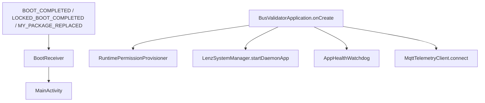

# Device Management

## Scope

`:core:devicemanager` handles unattended-device lifecycle support:

- Application health watchdog.
- Initialization progress pipeline.
- MQTT remote command handling.
- LENZ system/device manager wrapper.

Root command execution and permission provisioning live in `:core:security`.

## Boot and Process Lifecycle

Manifest context:

- `MainActivity` is launcher, HOME, and DEFAULT.
- `BootReceiver` is direct-boot aware.
- `BusValidatorDeviceAdminReceiver` declares device admin metadata.

## Runtime Permission Provisioning

`RuntimePermissionProvisioner.ensureProvisioned()`:

- Reads declared manifest permissions.
- Attempts root `pm grant` for runtime permissions.
- Uses Device Owner/Profile Owner fallback for runtime grant when available.
- Runs root/appops/system commands for GPS, background execution, wake lock, battery idle whitelist, boot receiver, and HOME activity.

Expected dedicated-device assumption: root or Device Owner may be available. On emulator/non-root devices failures are expected and are logged.

## Watchdog

`AppHealthWatchdog.startWatchdog(scope)` currently:

- Runs every 5 seconds on `Dispatchers.Default`.
- Reads JVM heap usage.
- Logs critical memory pressure when used heap exceeds 90% of max heap.
- Invokes `System.gc()`.

It does not currently reboot or restart the app on heartbeat failure. That behavior is an intended extension, not implemented.

## Initialization Pipeline

`InitializationPipelineManager.runInitializationPipeline()` emits `InitStep` values:

1. `Verifying Root & Hardware Keystore...` 20%.
2. `Mounting Encrypted Database...` 40%.
3. `Autodetecting Hardware & SAM Slot...` 60%.
4. `Loading Operator Profile (...)...` 80%.
5. Builds local `TerminalConfig` from active `OperatorConfig`.
6. `Connecting TLS Telemetry to ...` 95%.
7. `Completed(terminalConfig)`.

The pipeline currently simulates delays and local config. It does not fetch/validate real terminal parameters from backend yet.

## Remote Commands

`RemoteControlManager.listenRemoteCommands(scope)` collects `MqttTelemetryClient.remoteCommandFlow` and handles:

| Command | Behavior |
| --- | --- |
| `cmd_reboot` | Calls `SuManager.rebootDevice()`. |
| `cmd_restart_app` | Runs `am force-stop` then starts `MainActivity`. |
| `cmd_clear_cache` | Calls `System.gc()`. |

Any new command must be allowlisted and parameter-validated. Avoid arbitrary shell command passthrough from MQTT.

## LENZ Device Manager

`LenzDeviceManager` wraps LENZ SDK calls:

- Reboot/shutdown.
- Install/uninstall app.
- Kernel, boot, hardware, and SDK version.
- Firmware update.
- System command execution through SDK.

This layer imports LENZ SDK classes directly and must remain outside UI/domain modules.

## Extension Requirements

- Add heartbeat-based restart only after defining false-positive handling.
- Add signed remote command payload verification before field use.
- Add OTA checksum/signature validation before calling install.
- Persist init failure reason and device identity for support diagnostics.
