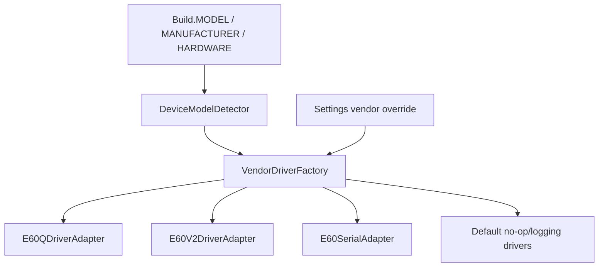

# Hardware Abstraction Layer

## Objective

The app must support multiple validator hardware models without letting vendor SDK classes leak into UI/payment/domain code. `:core:hardware-api` defines the contracts; `:core:hardware-drivers` adapts specific devices.

## Implemented Contracts

`core/hardware-api/src/main/java/com/enterprise/busvalidator/core/hardware/api/HardwareInterfaces.kt` contains:

| Contract | Methods |
| --- | --- |
| `NfcDriver` | `startCardListening(onCardDetected)`, `stopCardListening()`, `isHardwareAvailable()` |
| `SamDriver` | `powerOnSamSlot(slotIndex)`, `transmitSamApdu(apduCommand, slotIndex)`, `powerOffSamSlot(slotIndex)` |
| `SerialDriver` | `openSerialPort(portPath, baudRate)`, `writeSerialData(data)`, `readSerialDataFlow()`, `closeSerialPort()` |
| `ScannerDriver` | `startQrScan(onQrScanned)`, `stopQrScan()` |
| `LedDriver` | `setLedSuccess()`, `setLedFailed()`, `setLedProcessing()`, `turnOffLeds()` |
| `AudioDriver` | `playSound(soundType)` |
| `KeypadDriver` | `keyEventsFlow()` |

These are the only hardware APIs feature/payment code should consume.

## Device Detection and Factory



`DeviceModelDetector.detectDeviceModel()` maps:

- `E60Q` -> `VendorDeviceModel.E60Q`
- `E60V2` or broad `E60` -> `VendorDeviceModel.E60V2`
- `Q6`, `Z90`, `A90`, `Z91`, `TELPO`, `MSI` -> enum values
- otherwise -> `GENERIC`

`VendorDriverFactory` currently returns concrete adapters only for E60Q/E60V2. Other models fall back to default logging/no-op implementations.

## E60 Integration Status

| Area | E60Q | E60V2 | Notes |
| --- | --- | --- | --- |
| NFC/SAM/LED/audio/scanner adapter | Present | Present | Implemented in `E60DriverAdapters.kt`. |
| Serial | Present via shared `E60SerialAdapter` | Present via shared `E60SerialAdapter` | Uses SDK/system integration assumptions. |
| Camera QR scanner | Not primary path | Present as `E60V2CameraScannerEngine` | Uses CameraX, ML Kit, ZXing fallback. |
| Unit tests | Minimal | Not complete | Current test only checks `E60QDriverAdapter.isHardwareAvailable()`. |

## Vendor SDK Placement

Expected files:

```text
libs/vendor-sdk/e60/E60Q/E60QSDK-release.aar
libs/vendor-sdk/e60/E60Q/jtbqrcodesdk-release.aar
libs/vendor-sdk/e60/E60V2/E60V2SDK-release.aar
```

Gradle uses them as `compileOnly` in `:app`, `:core:hardware-drivers`, and `:core:devicemanager`.

## Adding a New Vendor

1. Add/confirm `VendorDeviceModel` enum.
2. Implement the required HAL interfaces in `:core:hardware-drivers`.
3. Keep SDK imports inside the driver implementation.
4. Update `DeviceModelDetector`.
5. Update `VendorDriverFactory`.
6. Add unit tests with fake SDK boundary where possible.
7. Add device QA steps in this doc and README status table.

## Current Gaps

- Q6/Z90/A90/Z91/TELPO/MSI have enum detection but no concrete driver implementation.
- `Default*Driver` classes report/log success-like behavior and must not be used for field acceptance.
- Hardware calls are mostly synchronous contracts today; if a vendor SDK blocks, wrap it in controlled dispatcher/timeouts at the adapter boundary.
