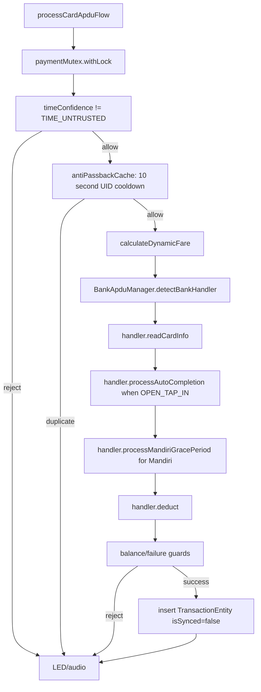

# Payment Engine

## Responsibility

`:core:payment` owns fare calculation, transaction serialization, bank APDU orchestration, QRIS payload handling, transaction ledger persistence, and LED/audio feedback selection.

UI modules render `UiTransactionState`; they do not own payment rules.

## Main Classes

| Class | Responsibility |
| --- | --- |
| `PaymentEngine` | Entry point for card and QRIS flows. Owns mutex, time gate, anti-passback, fare calculation, DB commit, feedback. |
| `BankApduManager` | Probes bank handlers and executes card APDU pipeline. |
| `BankApduHandler` | Contract implemented by each bank/card protocol. |
| `QrisPaymentEngine` | Generates/processes QRIS payload, CRC16-CCITT verification, RRN-style transCode. |
| `TransCodeGenerator` | Deterministic bank transCode helper based on issuer/card/counter/time/amount hash. |

## Card Flow



Current card guard behavior:

- Time confidence gate rejects `TIME_UNTRUSTED`.
- Anti-passback rejects the same card UID within 10 seconds.
- Balance check rejects insufficient balance.
- Deduct failure returns `FAILED_WRITE_ROLLBACK`.
- Success persists transaction and updates the time checkpoint.

## QRIS Flow

`processQrisTapFlow()`:

1. Locks `paymentMutex`.
2. Calculates fare from `FareRulePolicy`.
3. Calls `QrisPaymentEngine.processQrisTapPayload()`.
4. Builds `TransactionRecord`.
5. Inserts into Room as unsynced.
6. Triggers LED/audio success.

`QrisPaymentEngine` supports:

- EMVCo-like dynamic QRIS payload generation.
- CRC16-CCITT checksum generation and validation.
- QRIS tap payload conversion to `QrisTapData`.

## Supported Bank Handler Classes

- `MandiriEmoneyApdu`
- `BcaFlazzApdu`
- `BriBrizziApdu`
- `BniTapCashApdu`
- `BankDkiJakCardApdu`
- `BankNobuApdu`
- `KmtFelicaApdu`

These handlers are implementation foundations. Real production settlement still requires vendor/card/SAM validation and bank certification.

## Persistence Contract

Successful card/QRIS records are inserted into `transactions` with:

- `transactionId`
- `transCode`
- `transactionCounter`
- `cardUid`
- `bankIssuer`
- `amountDeducted`
- `initialBalance`
- `finalBalance`
- `timestampUtc`
- `tapMode`
- `passengerProfile`
- `status`
- `isSynced = false`
- `recordSignature`

`recordSignature` currently uses SHA-256 digest text, not a real HMAC with secret key.

## Tests

Current tests live in `core/payment/src/test/.../BankApduAndQrisTest.kt` and cover:

- Mandiri grace period zero fare.
- Auto-completion transCode generation.
- BCA Flazz detection/read/deduct.
- QRIS generation and CRC validation.
- End-to-end card payment with mock APDU lambda.
- End-to-end QRIS payment.
- KMT FeliCa read/deduct.

Run:

```bash
./gradlew :core:payment:testDebugUnitTest
```

## Adding a New Bank/Card Handler

1. Implement `BankApduHandler`.
2. Add constructor injection to `BankApduManager`.
3. Add the handler to the `handlers` list.
4. Add select/read/deduct unit tests with deterministic APDU lambdas.
5. Add real-device/SAM QA evidence before marking field-ready.
6. Update this document and README status table.
