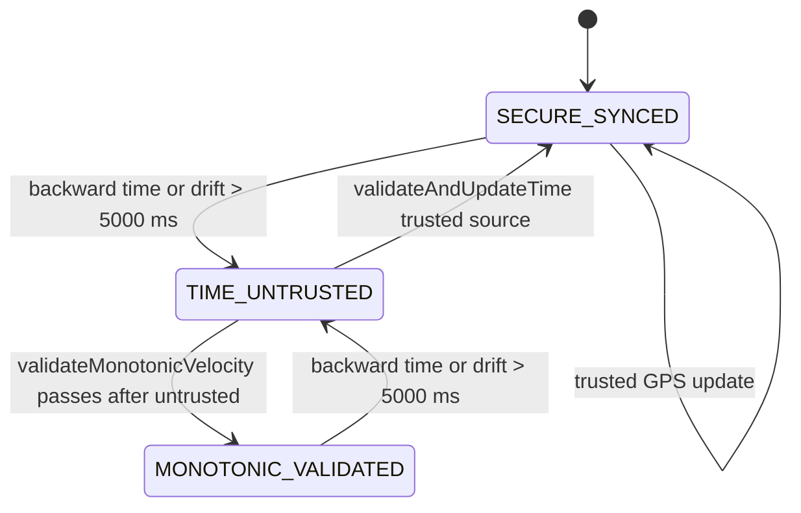
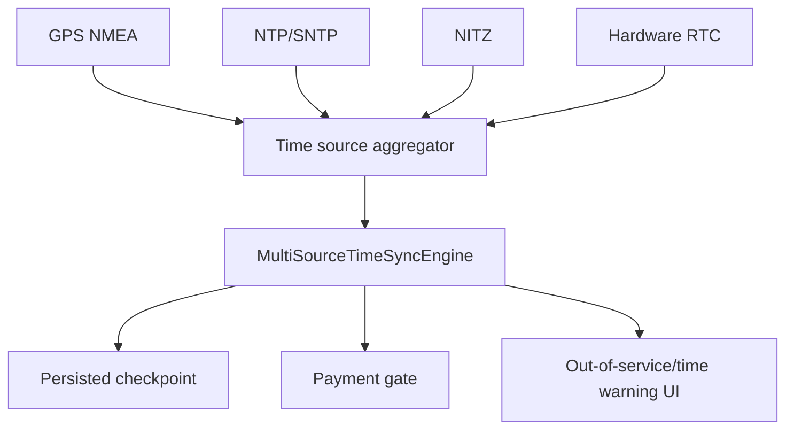

# Time Validation

## Problem

Payment timestamps are settlement-critical. A validator can be offline, rebooted, or tampered with, so the app needs confidence that wall-clock time has not jumped backward or drifted beyond tolerance.

## Current Implementation

Current code is in `core/security/MultiSourceTimeSyncEngine.kt`.

Implemented:

- `StateFlow<TimeConfidenceState>`.
- Initial state `SECURE_SYNCED`.
- Monotonic guard using `SystemClock.elapsedRealtimeNanos()`.
- Backward time check against in-memory `lastPersistedTimestampMs`.
- Drift threshold of 5000 ms.
- GPS NMEA hook through `onGpsNmeaTimeReceived(rawNmea)`.
- `$GPRMC` parser for UTC timestamp.
- Root time correction via `SuManager.setSystemTime()` when skew exceeds 3000 ms and root is available.
- Manual checkpoint update through `updatePersistedCheckpoint(timestampMs)`.

Not implemented yet:

- NTP client.
- NITZ listener.
- RTC `/dev/rtc0` reader.
- Persisted checkpoint stored in database/shared storage across process death.
- Direct integration from `BusLocationManager` NMEA listener into this engine.
- Payment queue suspension UI driven directly from `timeConfidence` outside payment result state.

## State Machine



## Payment Gate

`PaymentEngine.processCardApduFlow()` rejects card transactions when:

```kotlin
timeSyncEngine.timeConfidence.value == TimeConfidenceState.TIME_UNTRUSTED
```

The rejection path:

- Logs error.
- Sets failed LED.
- Plays failed beep.
- Returns `TransactionStatus.UNTRUSTED_TIME_REJECTED`.

QRIS flow does not currently perform the same explicit time-confidence check. Add parity if QRIS settlement requires the same timestamp guarantees.

## GPS Integration Gap

`BusLocationManager` currently requests GPS location updates but does not register an NMEA listener. To complete GPS time source:

1. Add Android NMEA listener in `BusLocationManager`.
2. Pass raw `$GPRMC`/`$GPZDA` sentences to `MultiSourceTimeSyncEngine.onGpsNmeaTimeReceived()`.
3. Handle runtime permission failure as degraded time confidence.
4. Add tests for valid/invalid NMEA payloads.

## Production Extension Path



Do not mark time validation production-ready until at least one trusted source and persisted checkpoint survive reboot and are verified on target hardware.
