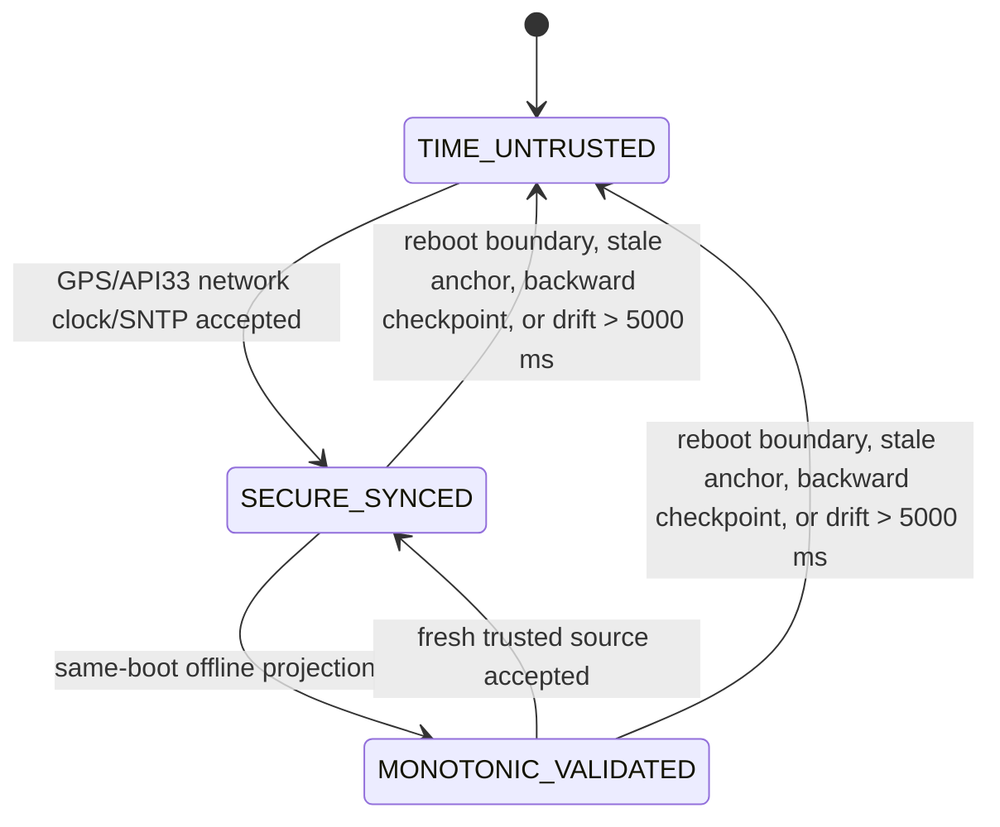

# Time Validation

## Problem

Payment timestamps are settlement-critical. A validator can be offline, rebooted, or tampered with, so the app must not trust `System.currentTimeMillis()` directly.

## Current Implementation

Current code is in `core/security/MultiSourceTimeSyncEngine.kt`.

Implemented:

- Initial state is `TIME_UNTRUSTED`, not trusted-by-default.
- Trusted sources:
  - GPS NMEA `$GPRMC`, `$GNRMC`, and `$GPZDA`.
  - Android `SystemClock.currentNetworkTimeClock()` on API 33+.
  - App-level SNTP fallback to `time.android.com` with 5 second timeout.
- Persisted `TimeAnchorStore` records trusted UTC, `elapsedRealtime`, last known good UTC, source, and uncertainty.
- Monotonic projection uses `trustedUtc + elapsedRealtime delta` during same-boot offline operation.
- Backward and forward wall-clock drift beyond 5 seconds marks time untrusted.
- Persisted checkpoints prevent transaction/audit timestamps from moving backward.
- Root clock correction is attempted when trusted-source skew exceeds 3 seconds.
- Continuous validation starts from `BusValidatorApplication`.
- Card and QRIS payment flows reject when `timeConfidence == TIME_UNTRUSTED`.

## Offline Rules

Offline is allowed only when the device has a same-boot trusted anchor.

Allowed:

- GPS/NMEA is available even without internet.
- Network time was synced earlier in the same boot, then internet drops.
- The wall clock changes but the persisted anchor plus `elapsedRealtime` can project UTC and root correction succeeds or the drift stays within tolerance.

Blocked:

- Fresh install with no trusted source.
- App/process starts and no persisted trusted anchor exists.
- Device rebooted offline and no GPS/NTP/NITZ/RTC trusted source is available.
- System wall clock moves behind the last transaction checkpoint.
- System wall clock jumps forward/backward more than 5 seconds from monotonic projection.

After reboot without network, GPS, carrier NITZ, or verified hardware RTC, an app cannot prove real UTC by itself. The safe behavior is `TIME_UNTRUSTED` and transaction rejection until a trusted source is reacquired.

## State Machine



## Payment Gate

`PaymentEngine.processCardApduFlow()` and `PaymentEngine.processQrisTapFlow()` both reject transactions when:

```kotlin
timeSyncEngine.timeConfidence.value == TimeConfidenceState.TIME_UNTRUSTED
```

Transaction timestamps use:

```kotlin
timeSyncEngine.currentValidatedUtcMillis()
```

This keeps audit records from moving behind the persisted checkpoint even when a rejected transaction is recorded during a clock anomaly.

## Remaining Field Verification

- Verify GNSS NMEA delivery on target LENZ firmware while app is HOME/foreground.
- Verify whether the device image exposes carrier NITZ through Android time detector.
- Verify whether vendor hardware RTC is accessible and reliable after power loss.
- Replace hard-coded time-anchor digest pepper before production threat-model acceptance.
