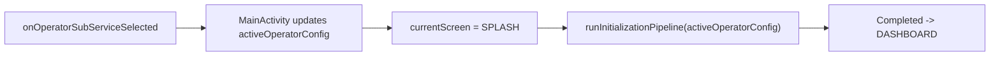

# UI and Flows

## Current UI Modules

| Module | Main files | Responsibility |
| --- | --- | --- |
| `:feature:validator` | `InitializationSplashScreen.kt`, `ValidatorMainScreen.kt` | Splash progress and validator dashboard/transaction states. |
| `:feature:settings` | `SettingsScreen.kt` | Operator preset and vendor override UI. |
| `:feature:diagnostic` | `HardwareDiagnosticScreen.kt`, `HardwareDiagnosticViewModel.kt` | Hardware diagnostic list and self-test orchestration. |

## Screen Ownership

`MainActivity` owns screen routing through:

```kotlin
enum class Screen {
    SPLASH,
    DASHBOARD,
    SETTINGS,
    DIAGNOSTIC
}
```

This is sufficient for the current small flow. If more screens are added, prefer a typed navigation/state owner instead of adding more activity-level branches.

## Splash Flow

`InteractiveInitializationSplashScreen` renders `InitStep`:

- `Progress(stepName, progressPercent)` with circular and linear progress.
- `Failed(errorReason)` with auto recovery state.
- `Completed(config)` with ready state.

`MainActivity` observes `initPipeline.initFlow` and moves to dashboard after `Completed`.

## Dashboard Flow

`ValidatorDashboardScreen` accepts:

- `TelemetryStatus`
- `TerminalConfig?`
- `UiTransactionState`
- `onTestTap`

Dashboard themes are selected by `OperatorBrand`:

- Biskita: dark blue/cyan transit layout.
- Citra: emerald/gold shuttle layout.
- Surabaya: maroon/amber municipal layout.

Transaction UI states:

- `Idle`
- `Processing(cardUid)`
- `Success(record)`
- `CardAlreadyTapped(cardUid)`
- `InsufficientBalance(balance, required)`
- `UntrustedTimeError(message)`

The bottom simulator bar triggers test taps for Flazz, Mandiri e-Money, TapCash, and Brizzi. This is a simulator/control surface, not the final production passenger interaction.

## Settings Flow

Settings allows:

- Operator selection from `OperatorPresets`.
- Vendor override: `AUTO`, `E60Q`, `E60V2`, `Q6`.
- Open diagnostic screen.

When operator changes:



## Diagnostic Flow

`HardwareDiagnosticViewModel` runs diagnostics in `init` and when requested:

- NFC start/stop.
- SAM slot 1 power on/off.
- LENZ SDK/kernel info.
- Scanner start/stop.
- Audio success beep.
- LED success/off.
- Serial COM1 115200 write `PING`.
- Static GPS/MQTT/SQLCipher status rows.

Static rows should be replaced with real injected health providers before field diagnostics.

## Physical Key Flow

Current `MainActivity.onKeyDown()`:

- `KEYCODE_DPAD_UP`: settings.
- `KEYCODE_DPAD_DOWN`: diagnostic.
- `KEYCODE_ESCAPE` or `KEYCODE_BACK`: dashboard if current screen is not dashboard.

`KeypadDriver.keyEventsFlow()` exists but is not wired into Compose navigation yet.

## UI Extension Rules

- Keep business logic out of composables.
- Pass state down and callbacks up.
- Put payment/init/sync behavior in core or ViewModel/use-case boundaries.
- For new hardware-admin screens, depend on HAL interfaces or injected managers, not vendor SDK classes directly.
- If adding route navigation beyond four states, introduce a small typed navigation model.
